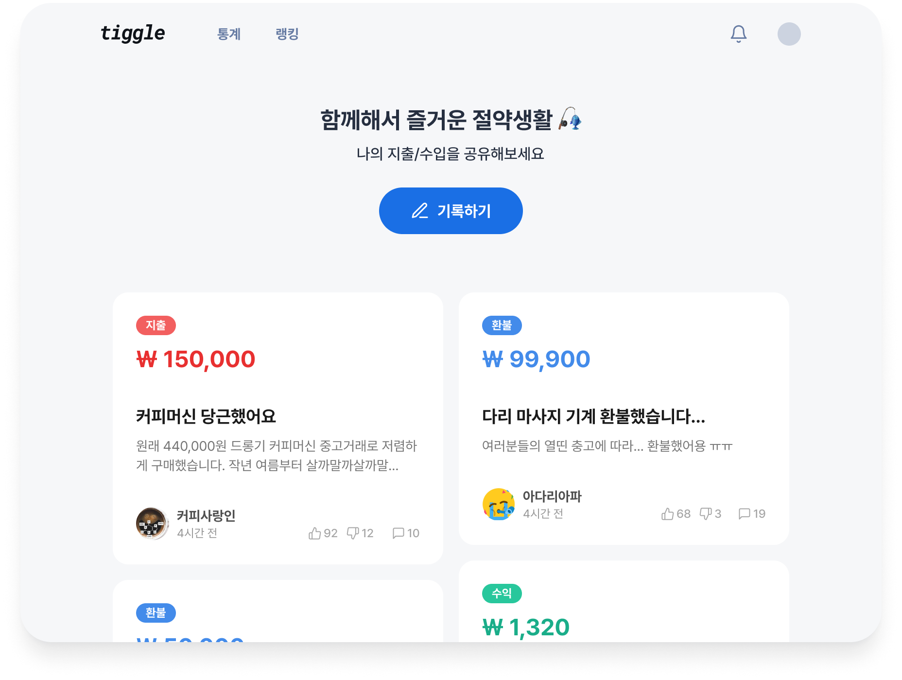

#### FE Core Stack

#### BE Core Stack

### ETC
  

 

## 소개
티끌은 각자의 소비 내역을 공유하고 절약을 위한 조언을 주고받는 **공유 가계부 플랫폼**입니다.
 
불경기와 고물가 시대, 티끌과 함께 즐겁게 절약하며 견뎌보아요. 🙂

티끌은 크게 3가지 기능을 제공합니다.
1. **거래 기록하기**: 나의 지출 내역, 수입 내역, 환불 내역을 기록할 수 있습니다.
2. **거래 평가하기**: 칭찬해요/아까워요 버튼으로 다른 사용자의 거래를 평가해 주세요. 간단한 코멘트도 남길 수 있습니다.
3. **내 거래 모아보기**: 지난 한 달간 내가 기록한 거래를 한눈에 볼 수 있습니다. 

[➡️ 티끌 Figma 보러 가기](https://www.figma.com/file/ak0eHSwx6SW3cYfR9MdPmG/High-Fidelity?type=design&node-id=197-138&mode=design)

 

티끌은 앞으로 다음과 같은 기능을 제공할 예정입니다.
1. 거래 통계 보기
2. 가계부 기능 확대
3. 절약왕 랭킹..

종합 라이프스타일 플랫폼으로 성장할 티끌을 기대해 주세요^^..

 

## 개발 일정
- **2023.07**: 팀 빌딩

- **2023.08**: 제품 기획, MVP 모델 개발 시작

- **2023.12**: ver.1 배포

 

## 버전 관리
- 회의 중...

 

## 브랜치 관리
- main : 배포 가능한 상태만 관리하는 브랜치
- dev : 다음 출시 버전 및 기능을 개발하는 브랜치
